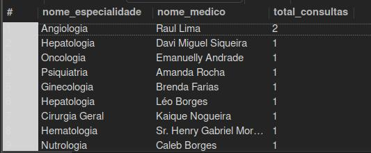
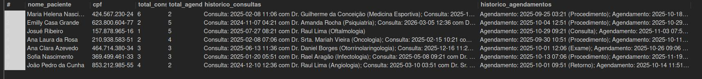
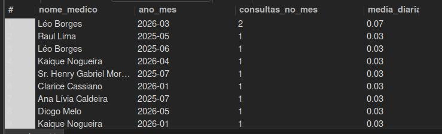
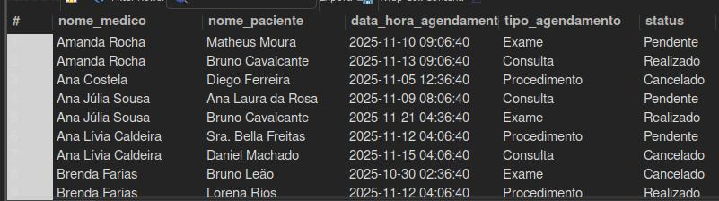
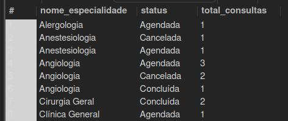
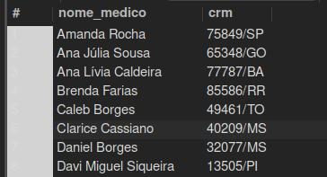

# Projeto Final: Sistema de Clínica Médica

## 1. Introdução

Este documento apresenta o projeto final de um sistema de banco de dados relacional para uma clínica médica. O objetivo foi projetar, construir e popular um banco de dados completo, além de extrair *insights* de negócio valiosos através de consultas analíticas. O projeto foi desenvolvido seguindo as melhores práticas de modelagem de dados e engenharia de *software*.

---

## 2. Ambiente de Desenvolvimento

O projeto foi desenvolvido e testado no seguinte ambiente:

-  **Banco de Dados:** MySQL **8.0+**
-  **IDE:** MySQL Workbench **8.x**
-  **Sistema Operacional:** Compatível com Windows, Linux e macOS
-  **Scripts:** SQL organizados por funcionalidade

>  **Pré-requisitos**:
> - Instalar o MySQL Server 8.0 ou superior  
> - Instalar o MySQL Workbench  
> - Ter permissões para criação de banco de dados e execução de scripts SQL

## 3. Modelo de Dados

O modelo de dados foi projetado para representar as principais entidades e seus relacionamentos dentro de uma clínica médica. As entidades incluem **Pacientes**, **Médicos**, **Especialidades**, **Consultas** e **Agendamentos**. Uma tabela de junção, **Medico_Especialidade**, foi criada para gerenciar o relacionamento N:M (muitos para muitos) entre médicos e especialidades.

A seguir, uma descrição detalhada de cada entidade e seus atributos:

### 3.1. Pacientes

| Atributo          | Tipo de Dados       | Descrição                                         | Restrições      |
| :---------------- | :------------------ | :------------------------------------------------ | :-------------- |
| `id_paciente`     | INT                 | Chave primária, identificador único do paciente.  | PK, AUTO_INCREMENT |
| `nome`            | VARCHAR(100)        | Nome completo do paciente.                        | NOT NULL        |
| `data_nascimento` | DATE                | Data de nascimento do paciente.                   | NOT NULL        |
| `cpf`             | VARCHAR(14)         | Cadastro de Pessoa Física do paciente.            | UNIQUE, NOT NULL |
| `telefone`        | VARCHAR(20)         | Número de telefone para contato.                  |                 |
| `email`           | VARCHAR(100)        | Endereço de e-mail do paciente.                   | UNIQUE          |
| `endereco`        | VARCHAR(255)        | Endereço completo do paciente.                    |                 |

### 3.2. Médicos

| Atributo      | Tipo de Dados       | Descrição                                         | Restrições      |
| :------------ | :------------------ | :------------------------------------------------ | :-------------- |
| `id_medico`   | INT                 | Chave primária, identificador único do médico.    | PK, AUTO_INCREMENT |
| `nome`        | VARCHAR(100)        | Nome completo do médico.                          | NOT NULL        |
| `crm`         | VARCHAR(20)         | Registro no Conselho Regional de Medicina.        | UNIQUE, NOT NULL |
| `telefone`    | VARCHAR(20)         | Número de telefone para contato.                  |                 |
| `email`       | VARCHAR(100)        | Endereço de e-mail do médico.                     | UNIQUE          |

### 3.3. Especialidades

| Atributo           | Tipo de Dados       | Descrição                                         | Restrições      |
| :----------------- | :------------------ | :------------------------------------------------ | :-------------- |
| `id_especialidade` | INT                 | Chave primária, identificador único da especialidade. | PK, AUTO_INCREMENT |
| `nome_especialidade` | VARCHAR(100)        | Nome da especialidade médica.                     | UNIQUE, NOT NULL |
| `descricao`        | TEXT                | Descrição detalhada da especialidade.             |                 |

### 3.4. Consultas

| Atributo           | Tipo de Dados       | Descrição                                         | Restrições      |
| :----------------- | :------------------ | :------------------------------------------------ | :-------------- |
| `id_consulta`      | INT                 | Chave primária, identificador único da consulta.  | PK, AUTO_INCREMENT |
| `paciente_id`      | INT                 | Chave estrangeira para a tabela `Pacientes`.      | FK, NOT NULL    |
| `medico_id`        | INT                 | Chave estrangeira para a tabela `Médicos`.        | FK, NOT NULL    |
| `especialidade_id` | INT                 | Chave estrangeira para a tabela `Especialidades`. | FK, NOT NULL    |
| `data_hora`        | DATETIME            | Data e hora da consulta.                          | NOT NULL        |
| `observacoes`      | TEXT                | Anotações e detalhes da consulta.                 |                 |
| `status`           | VARCHAR(50)         | Status atual da consulta (ex: 'Agendada', 'Concluída', 'Cancelada'). | DEFAULT 'Agendada' |

### 3.5. Agendamentos

| Atributo              | Tipo de Dados       | Descrição                                         | Restrições      |
| :-------------------- | :------------------ | :------------------------------------------------ | :-------------- |
| `id_agendamento`      | INT                 | Chave primária, identificador único do agendamento. | PK, AUTO_INCREMENT |
| `paciente_id`         | INT                 | Chave estrangeira para a tabela `Pacientes`.      | FK, NOT NULL    |
| `medico_id`           | INT                 | Chave estrangeira para a tabela `Médicos`.        | FK, NOT NULL    |
| `data_hora_agendamento` | DATETIME            | Data e hora do agendamento.                       | NOT NULL        |
| `tipo_agendamento`    | VARCHAR(50)         | Tipo de agendamento (ex: 'Consulta', 'Exame', 'Retorno'). |                 |
| `status`              | VARCHAR(50)         | Status atual do agendamento (ex: 'Confirmado', 'Pendente', 'Realizado'). | DEFAULT 'Confirmado' |

### 2.6. Medico_Especialidade (Tabela de Junção)

| Atributo           | Tipo de Dados       | Descrição                                         | Restrições      |
| :----------------- | :------------------ | :------------------------------------------------ | :-------------- |
| `medico_id`        | INT                 | Chave estrangeira para a tabela `Médicos`.        | FK, NOT NULL    |
| `especialidade_id` | INT                 | Chave estrangeira para a tabela `Especialidades`. | FK, NOT NULL    |

## 4. Scripts SQL

Os scripts SQL para criação do esquema do banco de dados e inserção da massa de dados estão contidos em `scripts`. Este diretorio inclui:

*   Comandos `CREATE DATABASE` e `USE` para configurar o ambiente.
*   Comandos `CREATE TABLE` para todas as entidades descritas, incluindo chaves primárias, chaves estrangeiras e restrições.
*   Comandos `INSERT INTO` para popular as tabelas com uma massa de dados significativa.

O arquivo `criar_banco.sql` contém a estrutura criação do banco e das tabelas, e o `insert_dados.sql` contém apenas os dados gerados.

## 5. Massa de Dados

*   **Pacientes**: 30 registros com nomes, datas de nascimento, CPFs únicos, telefones, e-mails e endereços fictícios.
*   **Médicos**: 30 registros com nomes, CRMs únicos, telefones e e-mails fictícios.
*   **Especialidades**: 30 especialidades médicas comuns.
*   **Medico_Especialidade**: Relacionamentos N:M entre médicos e especialidades, garantindo que cada médico tenha entre 1 e 3 especialidades.
*   **Consultas**: Mais de 60 registros de consultas, associando pacientes, médicos e especialidades, com datas e horas variadas, observações e status.
*   **Agendamentos**: Mais de 60 registros de agendamentos, com pacientes, médicos, datas e horas, tipos de agendamento e status.

## 6. Consultas Analíticas

Um conjunto de consultas SQL analíticas foi desenvolvido para extrair *insights* valiosos dos dados. Estas consultas estão no arquivo `query_analiticas.sql` e abordam diferentes aspectos da operação da clínica:

1.  **Contagem de consultas por especialidade e por médico no último ano**: Permite identificar as especialidades e médicos mais requisitados.

2.  **Pacientes com mais de 5 agendamentos ou consultas no total, mostrando o histórico**: Identifica pacientes de alta frequência e detalha seu histórico de interações com a clínica.

3.  **Média de consultas por médico por mês no último semestre**: Oferece uma visão do volume de trabalho de cada médico ao longo do tempo.

4.  **Agendamentos futuros detalhados por médico**: Fornece uma lista clara dos compromissos futuros para cada profissional.

5.  **Distribuição de status de consultas por especialidade**: Ajuda a entender a eficiência e os gargalos em diferentes áreas da clínica (ex: quantas consultas foram canceladas em cardiologia).

6.  **Médicos que não tiveram consultas nos últimos 3 meses**: Identifica médicos com baixa atividade recente, o que pode indicar necessidade de realocação.

Estas consultas foram projetadas para uma análise de negócio da clínica médica, utilizando `JOINs`, `GROUP BY`, funções de agregação, `DATE_SUB`, `DATE_FORMAT` e `HAVING`, demonstrando a capacidade de extrair informações gerenciais a partir do banco de dados.

## 7. Conclusão

Este projeto demonstra a aplicação de princípios de modelagem de dados relacionais, implementação de esquema, geração de dados em larga escala e desenvolvimento de consultas analíticas para um cenário prático de clínica médica. O banco de dados resultante é robusto e serve como base sólida para futuras expansões e integrações com sistemas de *front-end*.

**Última atualização:** Outubro 2025
